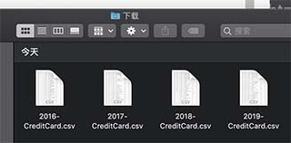

# qqmail-credit-card-downloader

# 这是什么？
这是一个Firefox扩展插件，如果你使用了QQ邮箱的账单助手，就可以用本插件下载邮箱助手中所有的信用卡数据并按年整理成csv格式，可用excel等电子表格打开。

# 怎么用？
1、使用Firefox浏览器加载本扩展

2、进入QQ邮箱账单助手页面，滚动到最下方，进入“更多历史账单”页面
（建议关闭除QQ邮箱页面外的所有其他标签页，后者未经测试）

3、点击Firefox的地址栏右侧的红色按钮

4、浏览器会自动打开很多标签页，不予理会等待它们自行关闭

5、在系统的默认下载文件夹可以找到按年份整理的csv格式的信用卡账单

# 怎么不好用？
可直接留言，留下任何能够帮助我解决问题的文字（包括但不仅限于你做了什么、步骤、浏览器console报错等等）

如果你懂得一些html，js，以及英语，可以尝试自行解决一下并贡献出你的bug-fix ;)

# 相关链接
https://developer.mozilla.org/en-US/docs/Mozilla/Add-ons/WebExtensions